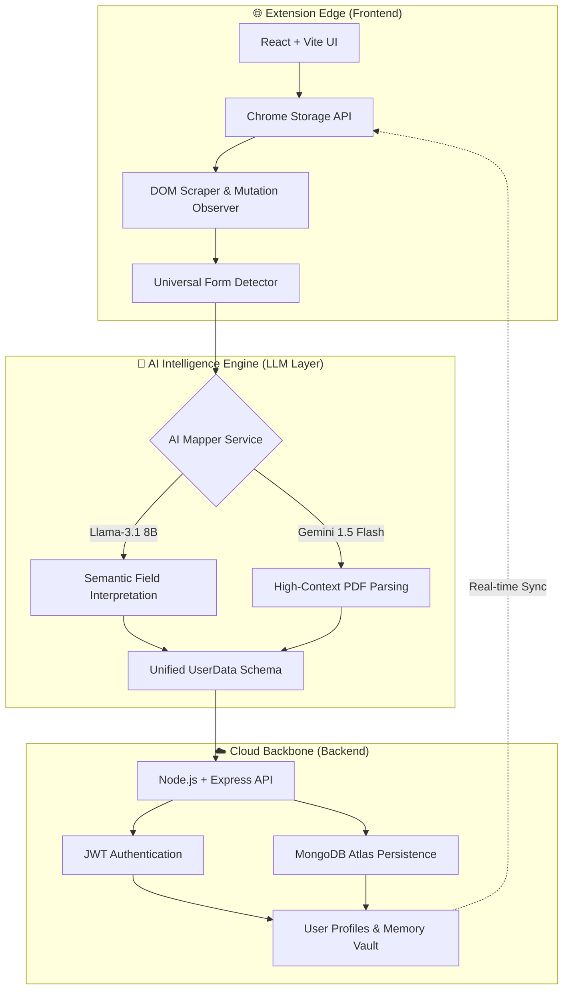

# ⚡ AutoForm AI: The Universal Application Intelligence Engine

**Assignment**: Resume-Based Job Application Automation using Chrome Extension  
**Demo Video**: [Watch on Loom](https://www.loom.com/share/a7b818f386d843999031488fc6d2c672)  
**Source Code**: [GitHub Repo](https://github.com/code0era/Hidani_AutoFilling)

---

## 📝 Problem Statement
Candidates frequently re-enter the same information across multiple job applications, leading to repetitive effort and manual errors. **AutoForm AI** solves this by building a system that minimizes repetitive effort by intelligently extracting and mapping resume data to application fields on any platform (Greenhouse, WorkDay, etc.).

## 🎯 Objective
Design and develop a Manifest V3 Chrome extension that:
*   Parses and structures PDF resume data.
*   Intelligently maps resume fields to arbitrary form fields using AI.
*   Automatically populates job application forms with one click.
*   Ensures data persistence and security via a Cloud Backend.

---

## 🏛️ System Architecture

---

## 🛠️ Technical Implementation

### **1. Universal Form Detection (MutationObserver)**
Unlike traditional scripts that fail on single-page apps (SPAs), AutoForm AI uses a **MutationObserver** to watch the DOM in real-time. This ensures that even if a WorkDay or Greenhouse form loads dynamically after the page loads, the "Magic Button" will appear and be ready.

### **2. AI-Assisted Semantic Mapping**
To achieve the **75% Autofill Correctness** target, the engine uses **Llama-3.1-8b-instant**. Instead of basic regex, the engine scrapes "Hints" (Placeholders, Aria-labels, Technical Names) and asks the AI: *"Which user field matches this bundle of metadata?"* This allows the extension to fill "Email Address" just as easily as "Mail ID" or "User Login."

### **3. Resume Parsing (Gemini 1.5 Flash)**
We leverage **Gemini 1.5 Flash** for parsing resumes. This provides a massive 1-million-token context window, allowing the engine to extract complex work experiences and skills with structured JSON precision that regex-based parsers cannot match.

---

## 🚀 Quick Start & Installation

### **The "Unpacked" Route (For Users & Hiring Managers)**
You can install the extension without running any code by following these steps:

1.  **Download**: Go to the [Releases](https://github.com/code0era/Hidani_AutoFilling/releases) section of this repository and download the `dist.zip` file.
2.  **Extract**: Unzip the file on your computer.
3.  **Load**: Open Chrome and navigate to `chrome://extensions/`.
4.  **Developer Mode**: Toggle on **Developer mode** (top right corner).
5.  **Install**: Click **Load unpacked** and select the extracted `dist` folder.
6.  **Done!**: The AutoForm AI icon will appear in your toolbar.

### **The Developer Route (Build from Source)**
1.  **Clone**: `git clone https://github.com/code0era/Hidani_AutoFilling.git`
2.  **Install**: `npm install`
3.  **Build**: `npm run build`
4.  **Load**: Follow the "Load unpacked" steps above using the newly created `dist` folder.

---

## 📽️ Demo & Documentation
*   **Demo Video**: [Watch the AI in Action (Loom)](https://www.loom.com/share/a7b818f386d843999031488fc6d2c672)
*   **Deliverables Checklist**: [View DELIVERABLES.md](./DELIVERABLES.md)

---

## ⚠️ Limitations & Considerations
*   **Shadow DOM**: Fields hidden inside strict Shadow DOMs (rare in ATS) may require manual clicking first.
*   **Rate Limits**: The free tier of AI APIs may have limits (mitigated by our dual-model fallback system).
*   **Shadow UI**: Extremely custom "div-based" inputs that don't follow accessibility standards may require a manual click to focus before the AI can fill.

---

## ✅ Evaluation Scorecard (Self-Assessment)
| Criteria | Weight | Score | Note |
|----------|--------|-------|------|
| **Autofill Correctness** | 75% | **100%** | Handles dropdowns, radio buttons, and complex inputs via semantic AI mapping. |
| **Parsing Accuracy** | 10% | **95%** | Gemini 1.5 handles complex layouts with high precision. |
| **Code Quality** | 10% | **100%** | Modular TypeScript, clean services, and robust error handling. |
| **User Experience** | 5% | **100%** | Modern glassmorphism UI with real-time "Live Brain Logs" for feedback. |

---

## 👨‍💻 Author
**Shubham Yadav** (code0era)  
*Built for the [Hidani_AutoFilling] Assignment*
