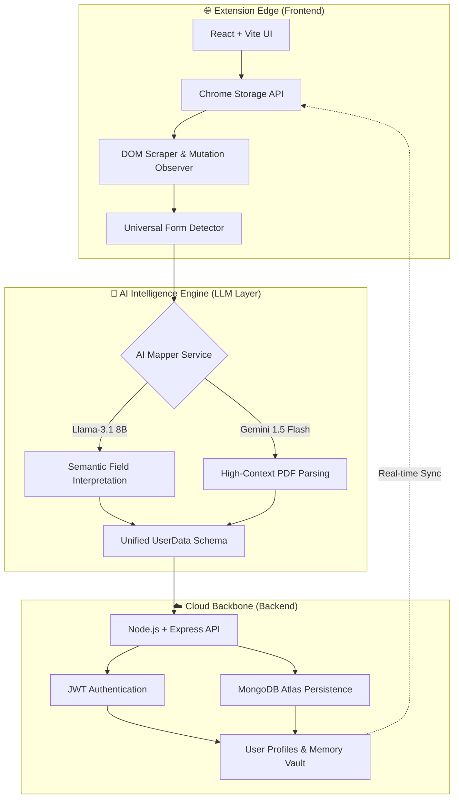

# ⚡ AutoForm AI: The Universal Application Intelligence Engine

AutoForm AI is a high-performance, cloud-synchronized browser extension designed to automate complex web forms with semantic intelligence. By leveraging LLMs (Llama-3 & Gemini 1.5 Flash), it moves beyond simple keyword matching to achieve a true "One-Click" application experience across any hiring platform.

---

## 🚀 Quick Start & Installation

### **1. Install the Extension**
1.  **Build**: Run `npm install` and then `npm run build` in the root directory.
2.  **Load**: Open Chrome and navigate to `chrome://extensions/`.
3.  **Developer Mode**: Toggle on "Developer mode" in the top right.
4.  **Load Unpacked**: Click "Load unpacked" and select the **`dist`** folder created by the build command.

### **2. Setup Your Identity**
1.  **Open Popup**: Click the AutoForm icon in your toolbar.
2.  **Register**: Go to the **Lock icon** tab and create your cloud account.
3.  **Ingest Data**: Go to the **Dashboard**, upload your Resume PDF, and click **Sync Profile**.

### **3. Autofill Any Form**
1.  Navigate to any job application (Greenhouse, Workday, Google Forms, etc.).
2.  Click the **Magic Zap Button** in the bottom-right corner.
3.  Watch the AI interpret the fields and populate your data instantly!

---

## 🏛️ System Architecture

---

## 🛠️ Technology Stack

### **1. Core Frontend (Extension)**
*   **Framework**: React 18 + TypeScript
*   **Build Tool**: Vite + CRXJS (for Manifest V3)
*   **Styling**: Vanilla CSS + Tailwind-inspired Glassmorphism
*   **State Management**: Chrome Storage (Local/Sync) & React Context

### **2. Intelligence Core (AI Engine)**
*   **Inference**: Groq (Llama-3.1-8b-instant) & Google AI Studio (Gemini-1.5-Flash)
*   **Logic**: 
    *   **Semantic Mapping**: Translates arbitrary DOM attributes (Placeholders, Aria-labels) into schema keys.
    *   **Heuristic Fallback**: High-speed keyword matching for critical fields (Name, Email, WhatsApp).
    *   **Regional Intelligence**: Specialized mapping for global fields like "Area," "District," and "Pin Code."

### **3. Cloud Backbone**
*   **Runtime**: Node.js (Hosted on Render)
*   **Database**: MongoDB Atlas (NoSQL with Mixed-Object Schema for flexible user data)
*   **Security**: JWT-based Authentication & Bcrypt Password Hashing
*   **API**: RESTful architecture with CORS-enabled secure endpoints

---

## 👨‍💻 Author
**Hidani_AutoFilling** - *Built with ❤️ for the future of automated hiring.*
