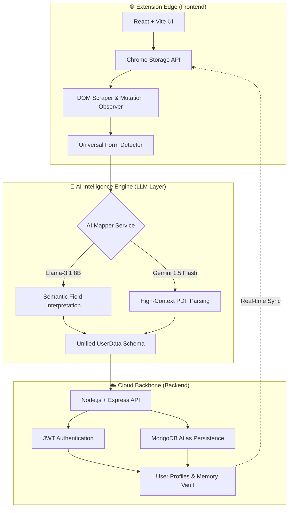

# ⚡ AutoForm AI: The Universal Application Intelligence Engine

AutoForm AI is a high-performance, cloud-synchronized browser extension designed to automate complex web forms with semantic intelligence. By leveraging LLMs (Llama-3 & Gemini 1.5 Flash), it moves beyond simple keyword matching to achieve a true "One-Click" application experience across any hiring platform.

---

## 🏛️ System Architecture

---

## 🛠️ Technology Stack

### **1. Core Frontend (Extension)**
*   **Framework**: React 18 + TypeScript
*   **Build Tool**: Vite + CRXJS (for Manifest V3)
*   **Styling**: Vanilla CSS + Tailwind-inspired Glassmorphism
*   **State Management**: Chrome Storage (Local/Sync) & React Context

### **2. Intelligence Core (AI Engine)**
*   **Inference**: Groq (Llama-3.1-8b-instant) & Google AI Studio (Gemini-1.5-Flash)
*   **Logic**: 
    *   **Semantic Mapping**: Translates arbitrary DOM attributes (Placeholders, Aria-labels) into schema keys.
    *   **Heuristic Fallback**: High-speed keyword matching for critical fields (Name, Email, WhatsApp).
    *   **Regional Intelligence**: Specialized mapping for global fields like "Area," "District," and "Pin Code."

### **3. Cloud Backbone**
*   **Runtime**: Node.js (Hosted on Render)
*   **Database**: MongoDB Atlas (NoSQL with Mixed-Object Schema for flexible user data)
*   **Security**: JWT-based Authentication & Bcrypt Password Hashing
*   **API**: RESTful architecture with CORS-enabled secure endpoints

---

## 🔄 The "Magic" Workflow

1.  **Ingestion**: The user uploads a PDF. The **Gemini Core** parses the raw text into a structured JSON profile.
2.  **Cloud Sync**: The profile is instantly encrypted and mirrored to the **MongoDB Cloud** via the Node.js API.
3.  **Detection**: On any website, the **Universal Detector** scans for 3+ input fields or specific ATS signatures (Greenhouse, Workday, etc.).
4.  **Deep Scan**: When the "Magic Button" is clicked, the **DOM Scraper** gathers metadata from every input box.
5.  **Interpretation**: The **AI Mapper** receives the metadata and decides: *"This 'Handle' field on this site is actually the user's Preferred Name."*
6.  **Automation**: The engine populates the fields and simulates user input events (input/change) to ensure the website accepts the data.

---

## 🚀 Deployment Status

*   **Backend**: Live on Render (`https://hidani-autofilling.onrender.com`)
*   **Database**: Production-ready MongoDB Atlas Cluster
*   **Version**: `1.0.0-PROD` (Manifest V3)

---

## 👨‍💻 Author
**Hidani_AutoFilling** - *Built with ❤️ for the future of automated hiring.*
